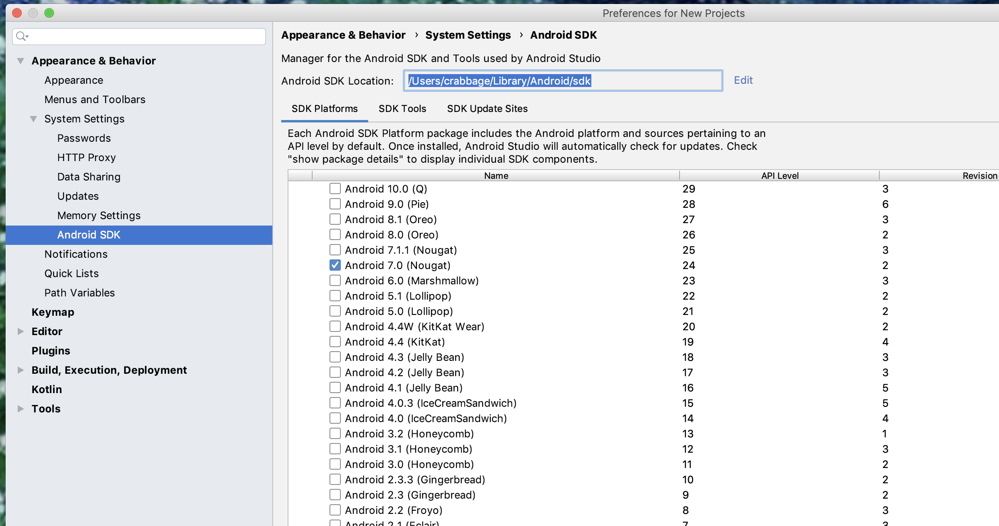
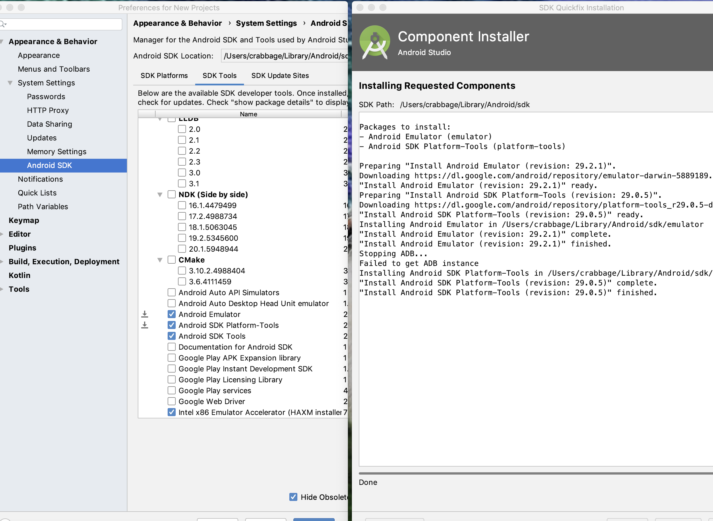
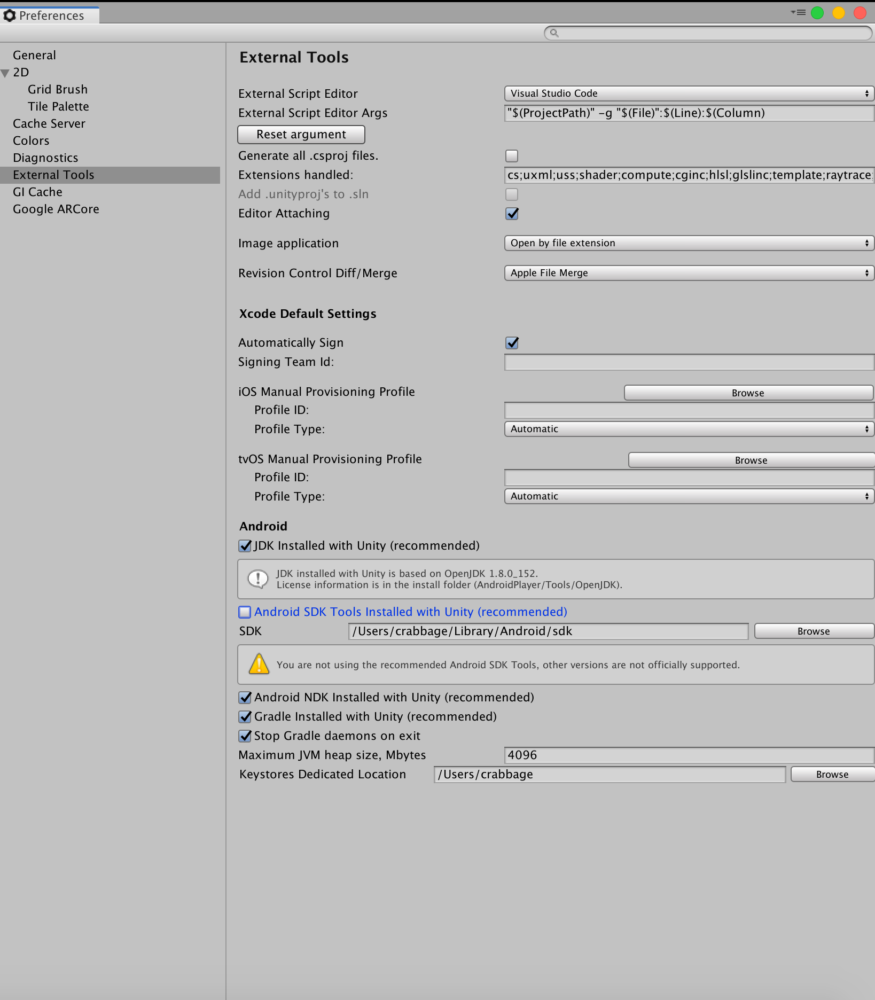
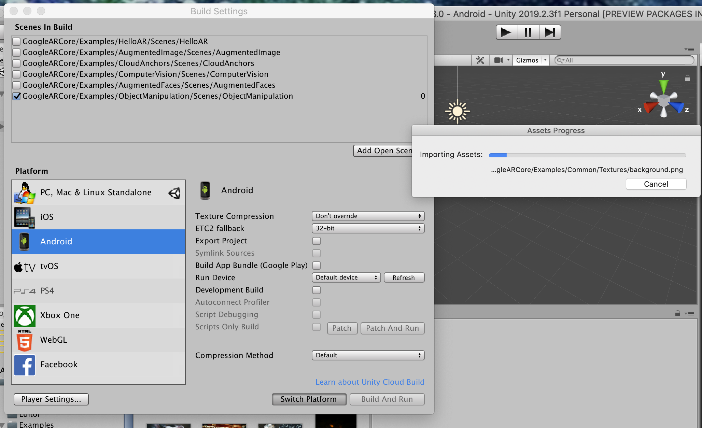
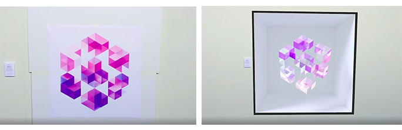

# ARCore tutorials

## Table of Contents
1. [Getting Started](#getting-started)
4. [ARCore in Unity](#arcore-in-unity)
    - [General Notes](#general-notes)
    - [Instant Preview](#instant-preview)
    - [Demo: HelloAR](#demo-helloar)
    - [Demo: Add Anchors Everywhere](#demo-add-anchors-everywhere)
    - [Demo: Augmented Images](#demo-augmented-images)
    - [Demo: Change Based on Distance](#demo-change-based-on-distance-from-camera)
    - [Demo: Face Mesh](#demo-face-mesh)
    - [Demo: Augmented Faces](#demo-augmented-faces)
    - [Demo: Computer Vision](#demo-computer-vision)
    - [Demo: Object Manipulation](#demo-object-manipulation)

# Getting started
See the official [Unity ARCore Quickstart page](https://developers.google.com/ar/develop/unity/quickstart-android) for instructions on setup.

You can download their official package from their site, or clone this repository with the below command, which is a version of their package that has been modified to include a few more examples (AddAnchorsEverywhere, ChangeBasedOnDistance, FaceMesh). If you clone this repository, the folder to open with Unity Hub is NOT the root directory, but the folder titled `arcore-unity-sdk-1.13.0`

`git clone ______`

### JDK/SDK Troubleshooting
If, when building, you run into any trouble that looks like it has to do with the JDK or SDK version, go to `Unity->Preferences->External Tools`
For the JDK, you should enable `JDK installed with Unity` (you need to have installed this JDK module under `Android Build Support` when you installed your version of Unity. If you didn't you can go to Unity Hub -> Installs -> Add Module).
1. Install android studio
2. Android studio -> SDK manager

3. version 24

4. Make sure all sdk tools are updated (sdk manager->sdk tools)

5. SDK view in unity -> set path

6. when build - switch platform

# ARCore in Unity

## General Notes
google has great documentation - read here- https://developers.google.com/ar/develop/unity
might want to skim the parts about lighting estimation

## Instant Preview

https://developers.google.com/ar/develop/unity/instant-preview

## Demo: HelloAR

*Note: current demos use a different object than the android character.*

Visualizes AR "points of interest" using a point cloud, draws planes, and allows the user to place objects upon the plane by tapping on the plane.

See Google's Tutorial page for [HelloAR](https://developers.google.com/ar/develop/unity/tutorials/hello-ar-sample).

## Demo: Add Anchors Everywhere

## Demo: Augmented Images

See Google's Documentation page for [Augumented Images](https://developers.google.com/ar/develop/unity/augmented-images).

## Demo: Change Based on Distance From Camera

## Demo: Face Mesh

https://developers.google.com/ar/develop/unity/augmented-faces/developer-guide

## Demo: Augmented Faces
 
*Image from Google ARCore Documentation*

See Google's Documentation page for [Augmented Faces](https://developers.google.com/ar/develop/unity/augmented-faces).

## Demo: Computer Vision

## Demo: Object Manipulation

See Google's Tutorial page for [object manipulation](https://developers.google.com/ar/develop/unity/tutorials/object-manipulation-sample).

## Demo: Cloud Anchors

See Google's Documentation page for [Cloud Anchors](https://developers.google.com/ar/develop/unity/cloud-anchors/quickstart-unity-android).

# License